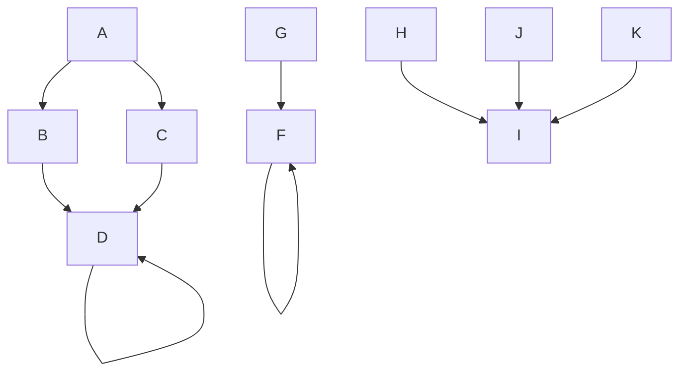
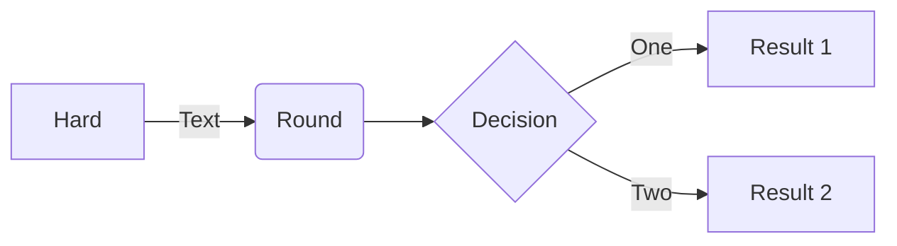
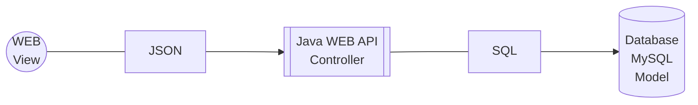
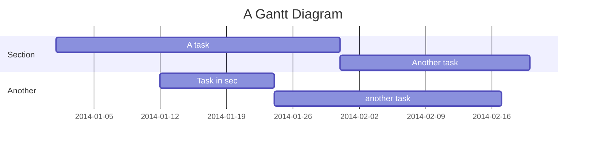

# md-graph
Markdown Graph with mermaid

```mermaid
  graph TD;
      A-->B;
      A-->C;
      B-->D;
      C-->D;
      D-->D;
      F-->F;
      G-->F;
      H-->I;
      J-->I;
      K-->I;
```

```mermaid
flowchart LR

A[Hard] -->|Text| B(Round)
B --> C{Decision}
C -->|One| D[Result 1]
C -->|Two| E[Result 2]
```

```mermaid
flowchart LR
    V((WEB<br>View))
    C[[Java WEB API<br>Controller]]
    M[(Database<br>MySQL<br>Model)]
    V<--- JSON --->C
    C<--- SQL --->M
```

```mermaid

gantt
    title A Gantt Diagram
    %% this is a comment
    dateFormat  YYYY-MM-DD
    section Section
    A task           :a1, 2014-01-01, 30d
    Another task     :after a1  , 20d
    section Another
    Task in sec      :2014-01-12  , 12d
    another task      : 24d
```

Referência: 
- https://github.com/mermaid-js/mermaid
- https://mermaid-js.github.io/mermaid
