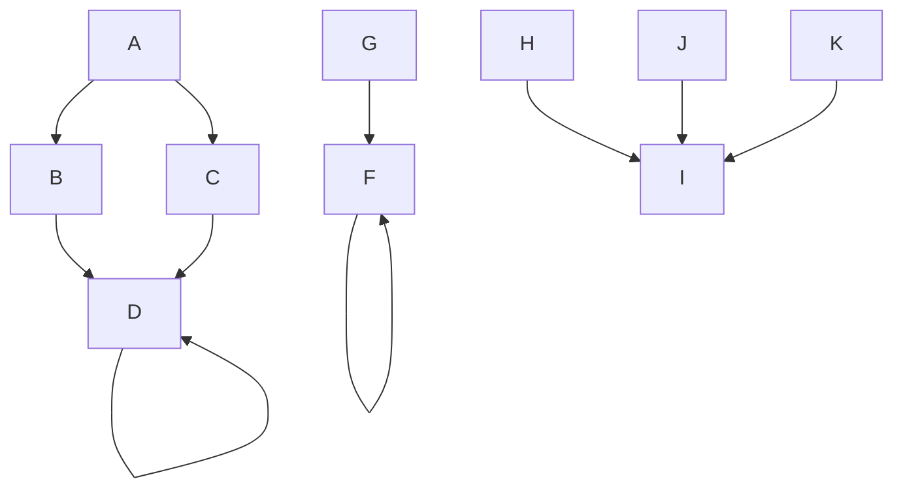
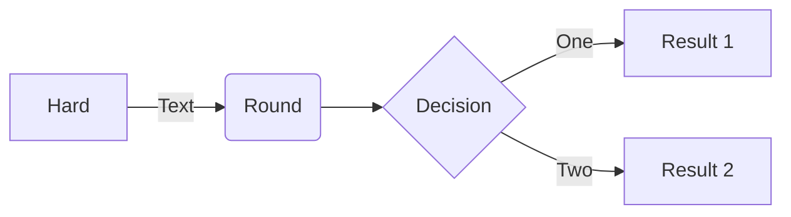

# md-graph
Markdown Graph

```mermaid
  graph TD;
      A-->B;
      A-->C;
      B-->D;
      C-->D;
      D-->D;
      F-->F;
      G-->F;
      H-->I;
      J-->I;
      K-->I;
```

```mermaid
flowchart LR

A[Hard] -->|Text| B(Round)
B --> C{Decision}
C -->|One| D[Result 1]
C -->|Two| E[Result 2]
```
